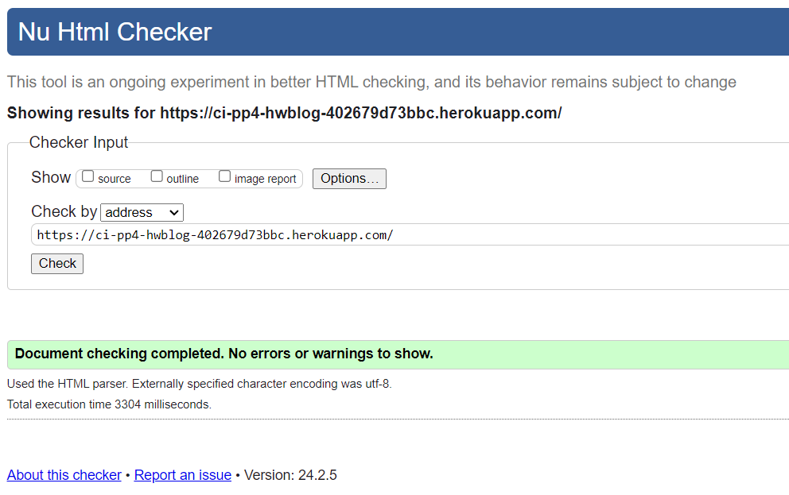
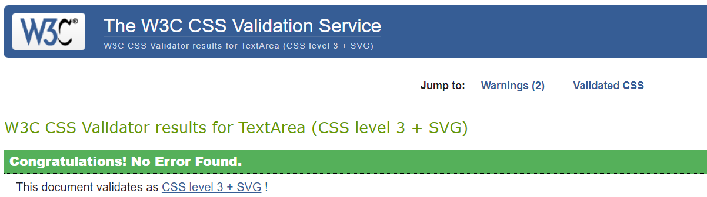
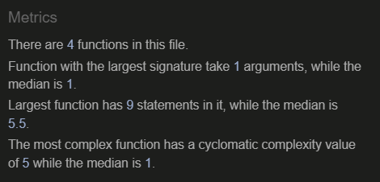
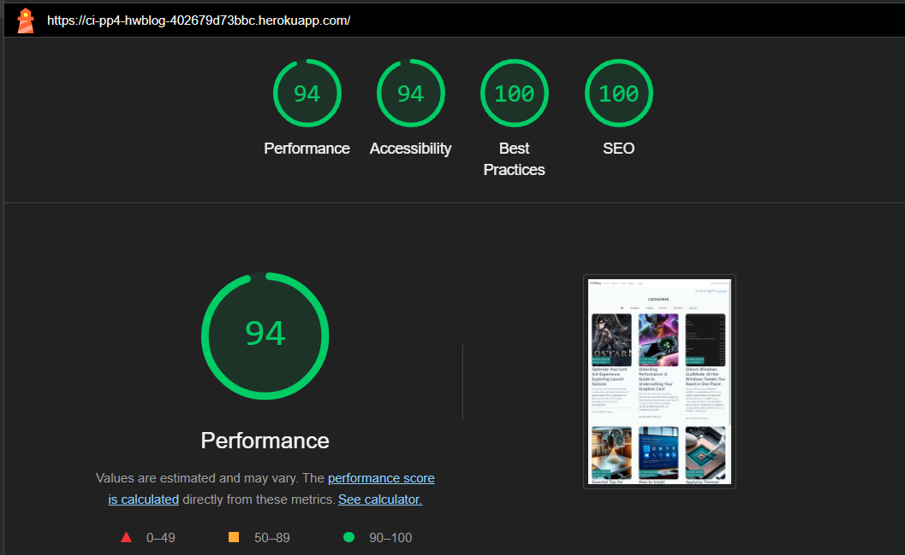
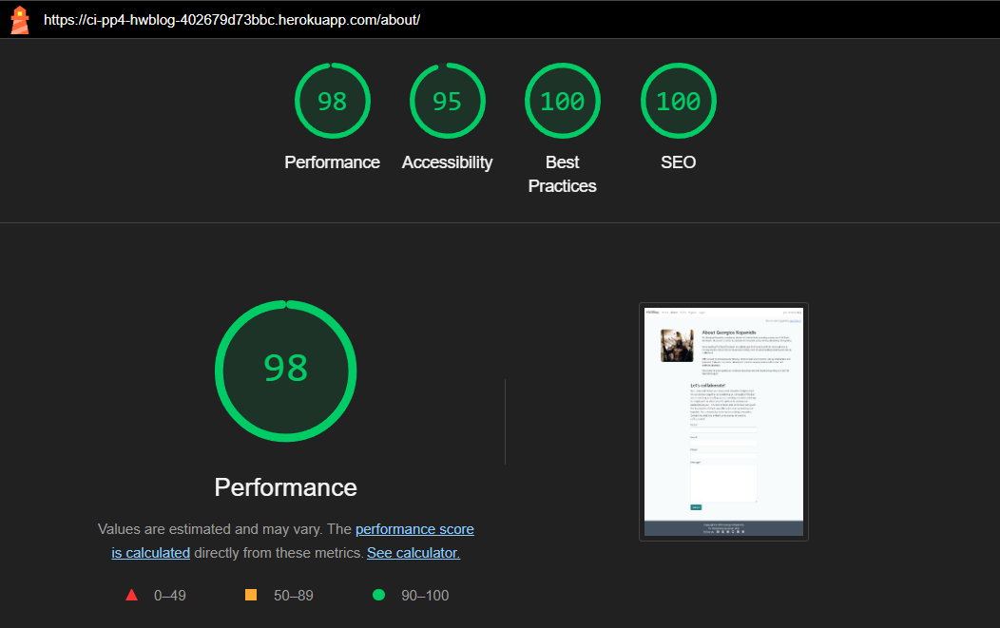
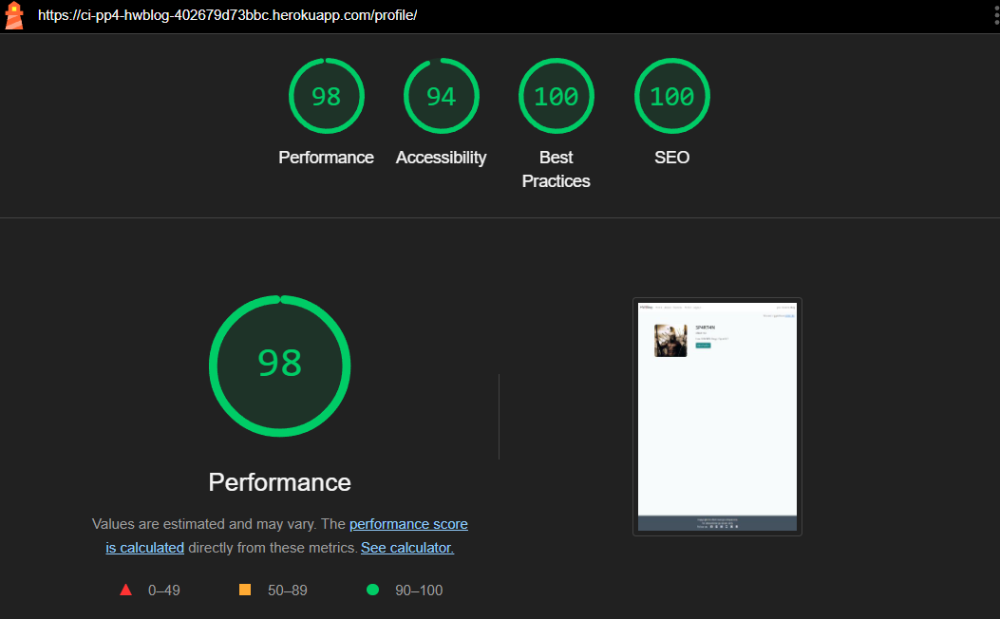
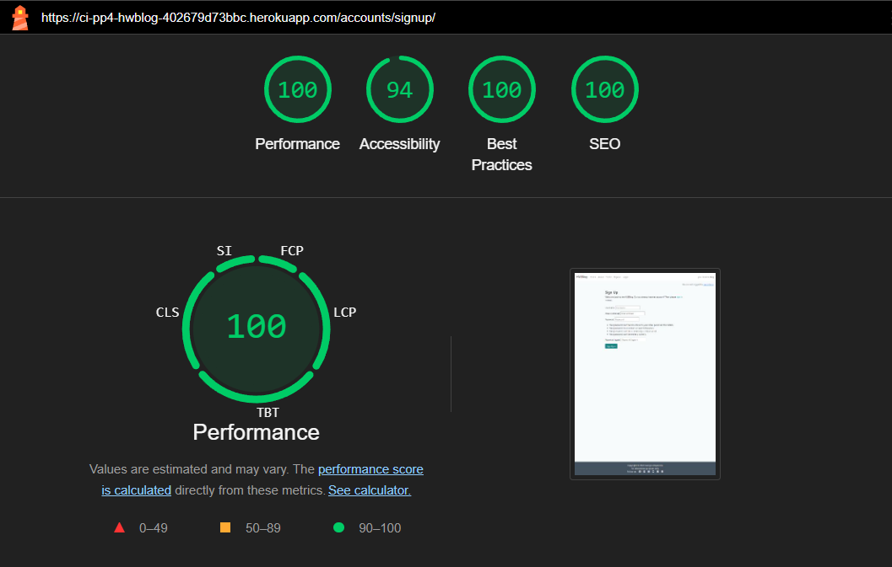
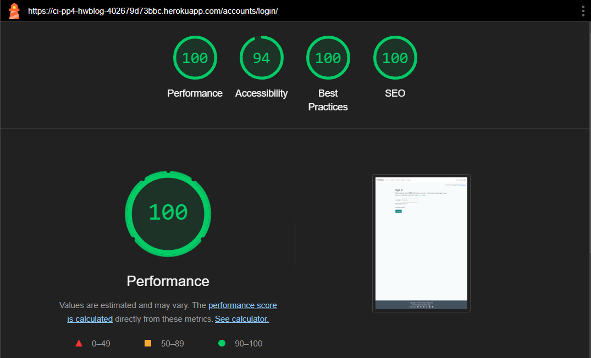

## Manual Testing
| Feature                           | Expectation                                              | Action                                            | Result                                                   |
|-----------------------------------|----------------------------------------------------------|---------------------------------------------------|----------------------------------------------------------|
| **View Comments**                 | Users should be able to view comments on posts           | Navigate to a post with comments                  | Comments are visible                                     |
| **Open a Post**                   | Users should be able to open and read a post in full detail | Click on a post                                  | Post opens and all details are visible                   |
| **Explore Paginated Post List**  | Users should be able to navigate through paginated posts | Navigate to the post list and use the pagination controls | User can navigate through different pages of posts       |
| **Add Post to Favorites**         | Users should be able to add posts to a favorites list    | Click on the "Add to Favorites" button on a post | Post is added to the user's favorites list               |
| **Profile Customization**         | Users should be able to customize their profile         | Navigate to the profile page and make changes     | Changes are saved and reflected in the profile           |
| **Category Viewing and Filtering**| Users should be able to view categories and filter posts by category | Navigate to the categories page and select a category | Posts are filtered by the selected category              |
| **Submit Request for Collaborations** | Users should be able to submit collaboration requests | Fill out and submit the collaboration request form | Collaboration request is submitted                        |
| **About Page Accessibility**      | Users should be able to access and read the About page  | Navigate to the About page                        | About page is visible and readable                       |
| **404 Page Visibility**           | Users should encounter a user-friendly 404 page when navigating to a nonexistent link | Navigate to a nonexistent link                   | User-friendly 404 page is displayed                      |
| **Store Collaboration Requests (Site Owners)** | Site owners should be able to store submitted collaboration requests for later review | Submit a collaboration request as a user, then view it as a site owner | Collaboration request is visible in the site owner's review list |
| **Mark Collaborations as Read (Site Owners)** | Site owners should be able to mark collaboration requests as read | Mark a collaboration request as read             | Collaboration request is marked as read                   |
| **Create an About Page (Site Owners)** | Site owners should be able to create an About page    | Create an About page as a site owner             | About page is created and visible to users               |
| **Review and Approve Comments (Site Owners)** | Site owners should be able to review and approve user comments | Review and approve a comment as a site owner   | Comment is approved and visible to users                 |

## Additional Validation Testing

In addition to the accessibility tests, several other tests were conducted to ensure the code quality and standard compliance of the project.

### W3C Testing

- **HTML**: Passed without any remarks.

  

- **CSS**: Passed without any remarks.

  

### JSHint Testing

- **JavaScript** code was analyzed using JSHint and passed without any remarks.

  

### PEP8 Testing

Python code was analyzed using PEP8 and passed without any remarks with the [CodeInstitute Python Linter](https://pep8ci.herokuapp.com/)

## Lightouse score

- **Index.html**

  

- **About.html**

  

- **Profile.html**

  

- **Register.html**

  

- **Login.html**

  

## Tested Browser
   - Latest versions:
     <table>
       <thead>
       <tr>
       <th align="center">Browser</th>
       <th align="center">Layout</th>
       <th align="center">Functionality</th>
       </tr>
       </thead>
       <tbody>
         <tr>
         <td align="center">Chrome</td>
         <td align="center">✔</td>
         <td align="center">✔</td>
         </tr>
         <tr>
         <td align="center">Edge</td>
         <td align="center">✔</td>
         <td align="center">✔</td>
         </tr>
         <tr>
         <td align="center">Firefox</td>
         <td align="center">✔</td>
         <td align="center">✔</td>
         </tr>
         <tr>
         <td align="center">Safari</td>
         <td align="center">✔</td>
         <td align="center">❌</td>
         </tr>
       </tbody>
     </table>